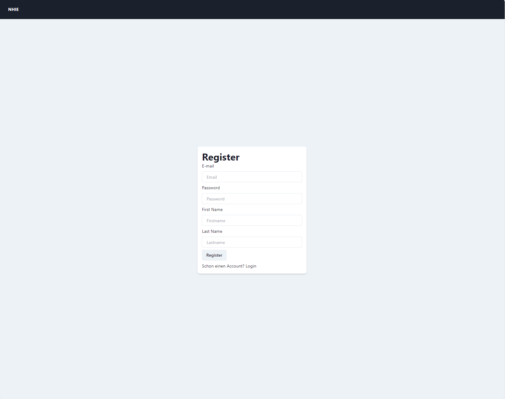
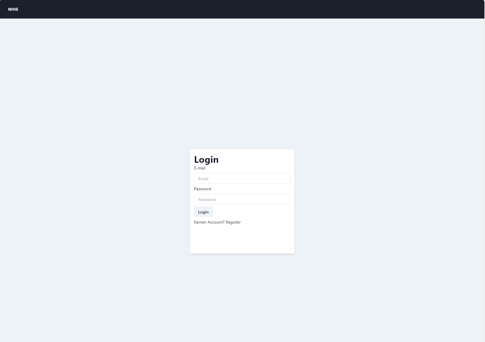
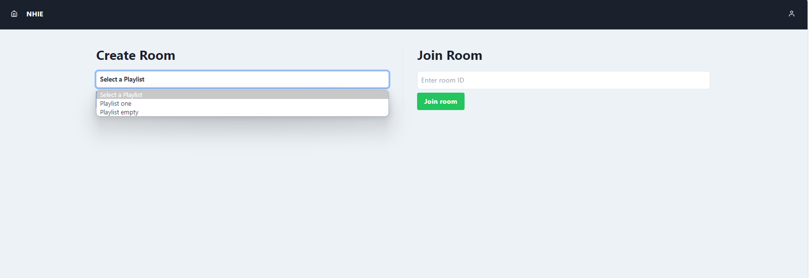
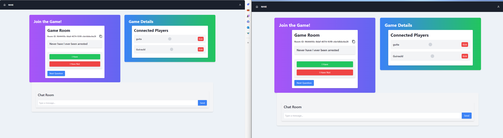
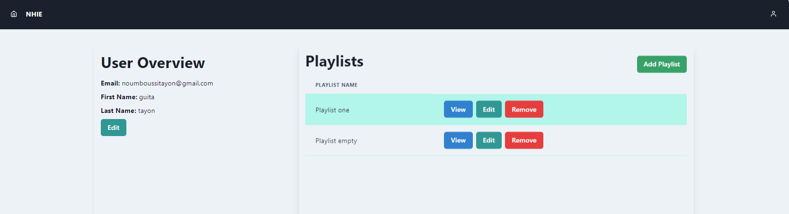

# Frontend

## Description

---

This is the user interface for the NHIE website. 
User can login , create a room and start playing with their friends. 

---
## Set up
Use the following steps in order to run frontend correctly.

1. Install all neccessary packages and dependencies via Package Manager npm in frontend.
```
cd /frontend
npm install
```
2. The Port for our website is 3001. So its URL is `localhost:3001`.
3. Use `npm run dev` command line to run frontend.

---
## REST Request format
The Rest Request sent to the backend has the following form:
```
const bodyContent = { <key>: <value> }
const response = await fetch("/api/<desire-uri>", {
    method: <desire method>",
    headers: {
    "Content-Type": "application/json",
    },
    body: JSON.stringify(bodyContent),
});
```

---

## Socket I/O
The logic of creating a room, adding players to the room, and synchronizing all the players depends on Socket I/O.
When any button during the game or the `create room` or `join room` button is pressed, 
the frontend will connect to the socket in the backend through the previously created socket and send the corresponding request to inform about an event. 
With each change sent to the backend socket, this socket will also notify all sockets connected to it.
- To send an event to backend-socket, this following form is used:
```
socket?.emit(<event>, { <key>: <value> });
```
- To receive response from backend-socket about the event, this following form is used:
```
socket?.on(<event>, <function>);
```

---


## Base Layout
A Page is mainly seperated into two part
- The top of the website is the Header which contains the name of the website and an user overview button
- The rest of the page is wide space to display the information that we need.

### Header
- The Header contains the name of the website. When user clicked in this logo name, they will be redirect to Home page.
- The user overview button will navigate you to the User Overview Page.

### Page
A parent page that can be override by a child page.

---
## Pages

This is all the pages that this NHIE website has.

### Login- and RegisterPage
When you first access the website you will be taken to the login page.
To be able to use the website's services you need to have an account and log in.
If you don't have an account, create one by clicking `Register`.

#### RegisterPage
You must fill in all required fields to be able to create an account. 
After successfully creating an account, you will be taken to the [Login Page](#loginpage).


#### LoginPage
Login to your account to use the website's services
After successfully logging into an account, you will be taken to the [Home Page](#homepage).


#### Page Functionalities
- Create a legit account
- Login into an account

---

### HomePage
In this page you have two options. 
1) Create a game room.
    In order to do this, you must first choose a playlist of questions you want to go through. 
    After that, click the button `Create Room` and you will be redirected to the [Game Page](#gamepage).

    
2) Join a game room. 
    To join a game room, you will need the room id in the blank field.
    Then click the button `Join Room` and you will be redirected to the [Game Page](#gamepage).



#### Page Functionalities
- Create a room
- Join a room

---

### GamePage
This page has 2 main parts.
- The left part includes the following:
  + The room id
  + The current question of the game
  + `i have` and `i have not` buttons
  + `next question` button
- The right part shows all the players that are currently and whether they have answer the question or not.



For AFK Player, there is a voting mechanism to kick this player out of the room.
If more than half of the players agree, that player will be kicked out of the game

After the game is finished, a result board will be given out.

#### Page Functionalities
- Change question of the game
- Kick the player out of the room
- Show players statistic
- Chat between players

---

### UserOverViewPage
This page display the following information:
- Personal data of the user.
- The created Playlist of the User.



> **Notice**
>
> When the user personal information is edited, the user password must be given. Else changes will not be committed
> 
> After the user information is edited, the user will be redirected to the login page.
>


## Tailwind CSS & Chakra UI Integration

For styling, we use a combination of Tailwind CSS for utility-first CSS classes and Chakra UI for its component library and theming capabilities. This approach allows for rapid development with consistent styling and responsive design.

### General Styling Approach

- Use Tailwind CSS for layout, spacing, sizing, and responsive design.
- Use Chakra UI components for complex UI elements like modals, buttons, and forms.
- Customize Chakra UI theme to align with the website's color scheme and typography, ensuring consistency across all components.

### Tailwind Usage

- **Layout and Grid**: Utilize Tailwind's flexbox and grid utilities to structure the page layout.
- **Spacing**: Apply margin and padding utilities for consistent spacing between elements.
- **Typography**: Use Tailwind's font size, weight, and line-height classes for text styling.
- **Responsiveness**: Employ responsive prefixes to adapt the layout and elements to different screen sizes.

### Chakra UI Components

- **Header**: Implement the header using Chakra's `Flex` and `Box` components for layout, along with the `Text` component for the website name. The user overview button can be a `Button` component with an icon.
- **Pages**: Use Chakra's `Container` or `VStack` for page layouts to ensure consistent max-width and spacing.
- **Forms**: For login, registration, and user information forms, use Chakra's `FormControl`, `Input`, `Button`, and `FormLabel` components for accessibility and consistent styling.
- **Game Elements**: Utilize Chakra's `Badge` for room IDs, `Button` for game actions, and `Modal` for AFK player voting and game results.

### Customization

- **Theme**: Customize Chakra's theme to match the website's branding, including colors, fonts, and component styles.
- **Icons**: Use Chakra's icon library or custom SVGs for icons in buttons and navigational elements.

### Implementation Tips

- For dynamic styling based on state or props, use Chakra's `useStyleConfig` or conditional Tailwind classes.
- For animations and transitions, explore Tailwind's animation utilities and Chakra's `Collapse`, `Fade`, `ScaleFade`, and `Slide` components.

By combining Tailwind's utility-first approach with Chakra UI's component library, we can achieve a balance between customization and rapid development, ensuring a cohesive and responsive user interface.


#### Page Functionalities
- Display User Information
- Edit User Information
- Create a Playlist
- Create a Question
- Edit a Playlist
- Edit a Question in Playlist
- View Playlist and Questions
- Delete an existed Playlist
- Delete an existed Question
