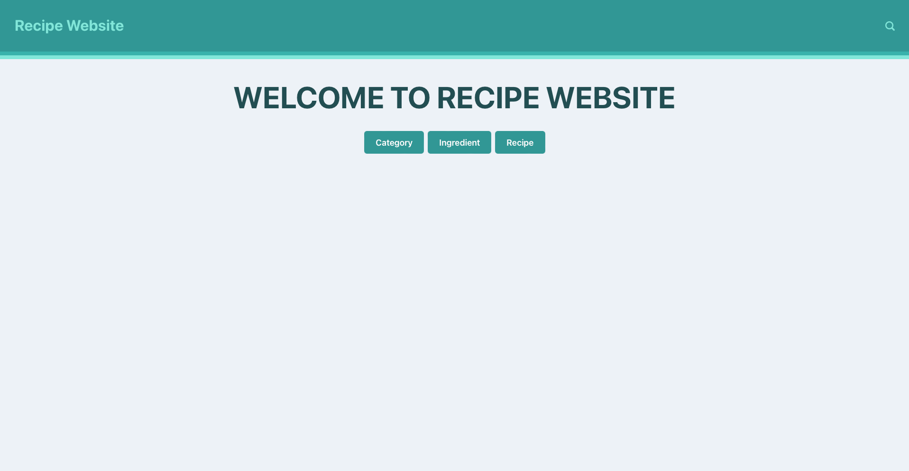
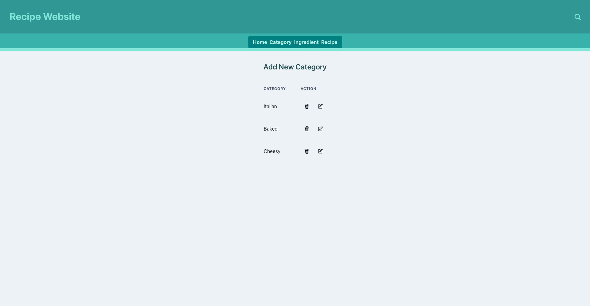
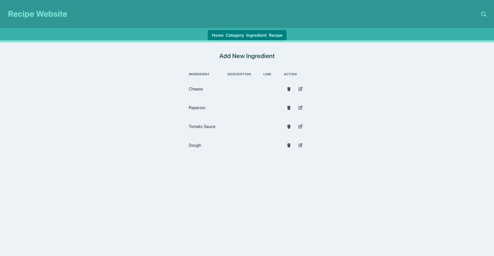
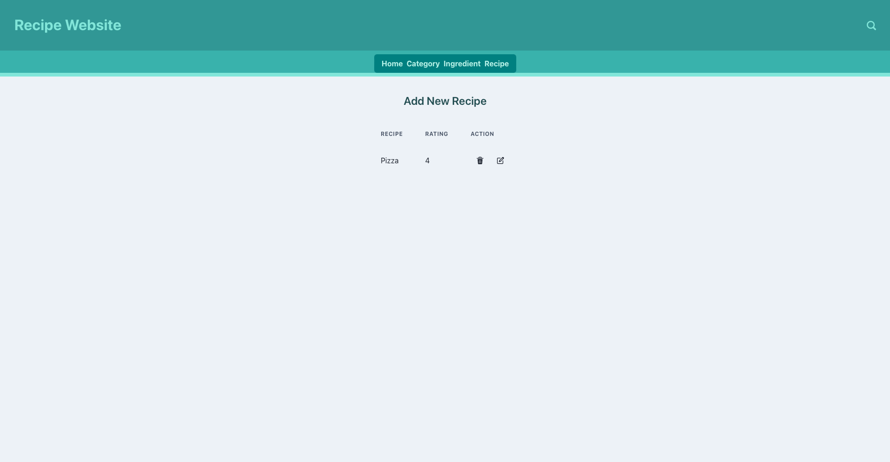
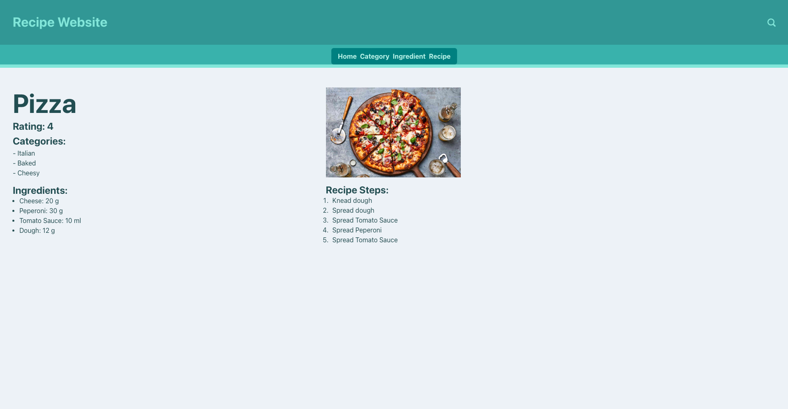
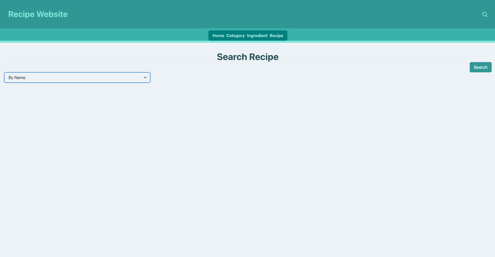
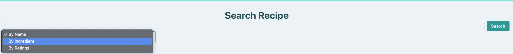

# Frontend

## Description

---

This is the user interface for the Recipes website. Here users can directly use the website to access information about ecipes

---
## Set up
Use the following steps in order to run frontend correctly.

1. Install all neccessary packages and dependencies via Package Manager npm in frontend.
```
cd /frontend
npm install
```
2. The Port for our website is 4000. So its URL is `localhost:4000`.
3. Use `npm run dev` command line to run frontend.

---
## REST Operation
All the operation, request and response is stored in `/frontent/WE_HA.yaml`. 
This file can be used to create code for an adapter, which communicate with backend automatically.

---

## Base Layout
A Page is mainly seperated into two part
- The top of the Website is the Header which contains the name of the website, a navigation bar and a search button
- The rest of the page is wide space to display the information that we need.

### Header
- The Header has a navigation bar which can leads to our pages through a list of horizontally placed button.
- The Search button will navigate you to the Search Page.

### Page
A parent page that can be override by a child page.

### Menu Components
The search button and the navigation bar are menu components which can be added into page as will.

---
## Pages

This is all the pages that this Recipe website has.
### HomePage
This page contains three button that can navigate you to CategoryPage, IngredientPage and RecipeTablePage.


---
### CategoryPage
This page display a table of all the categories. You can add new Category, edit an existed Category and delete an existed Category


---
### IngredientPage
This page display a table of all the ingredients. You can add new Ingredient, edit an existed Ingredient and delete an existed Ingredient


---
### RecipeTablePage
This page display a table of all the recipes.

> **Important**
>
> By clicking on the recipe name you can see all the information of the chosen recipe.
#### Funktionalities
- Add new Recipe
- Add new category for the recipe
- Add new ingredient for the recipe
- Add new step for the recipe
- Edit an existed Recipe 
- Delete an existed Recipe
- Delete categories from an existed Recipe
- Delete ingredients from an existed Recipe
- Delete steps from an existed Recipe
> **Notice**
>
> Please don't delete and add new recipe/step/category at the same time.
---
### RecipePage
This page display the recipe that you have chosen.


---
### SearchPage

#### There are three options to search a recipe.

#### Search Recipe By Name
- By giving in a name you can search whether there is a recipe with the name you gave in.
#### Search Recipe By Rating
- By giving in a number you can search whether there is a recipe with rating higher than the number you give in.
#### Search Recipe By Ingredient
- By giving in a name of an ingredient you can search whether there is recipes that have this ingredient.
